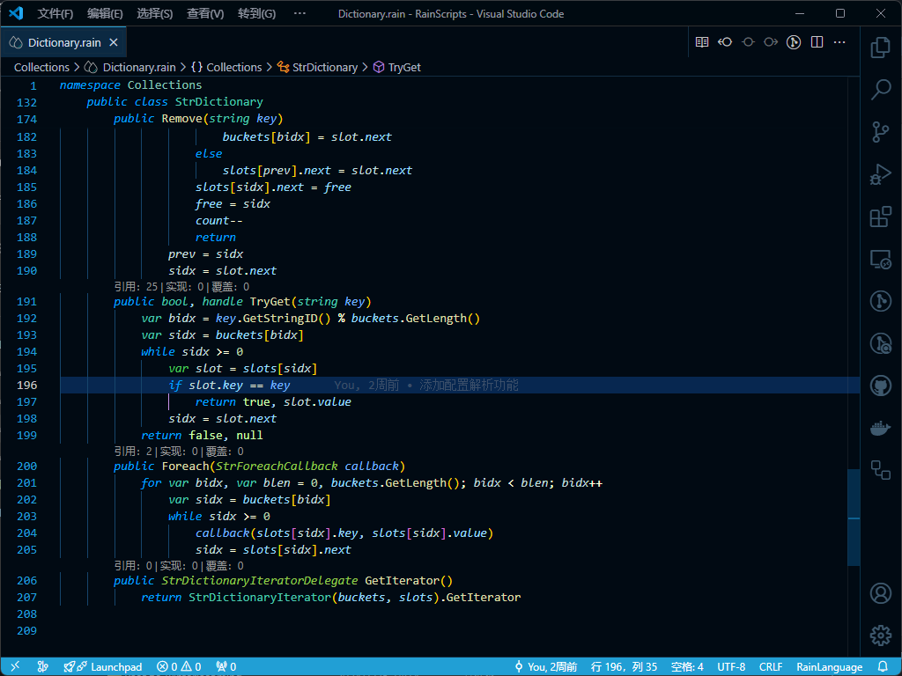

# vortex

This extension for Visual Studio Code adds themes titled "Rain". There are dark theme.

The themes also support an italicized version, with fonts that supports cursive italicized fonts.



## Recommended Settings

```js
{
  "editor.autoIndent": "full",
  "editor.cursorBlinking": "solid",
  "editor.cursorSmoothCaretAnimation": true,
  "editor.cursorStyle": "line",
  "editor.fontSize": 16,
  "editor.fontFamily": "Dank Mono, Fira Code, Inconsolata",
  "editor.fontLigatures": true,
  "editor.formatOnPaste": true,
  "editor.formatOnType": false,
  "editor.formatOnSave": true,
  "editor.letterSpacing": 0.3,
  "editor.lineHeight": 25,
  "editor.minimap.enabled": false,
  "editor.multiCursorModifier": "ctrlCmd",
  "editor.suggestSelection": "first",
  "editor.tabCompletion": "on",
  "editor.tabSize": 2,
  "editor.wordWrap": "on",
  "files.autoSave": "afterDelay",
  "files.autoSaveDelay": 1000,
  "search.showLineNumbers": true,
  "workbench.iconTheme": "material-icon-theme",
  "workbench.colorCustomizations": {},
  "workbench.colorTheme": "Winter is Coming (Dark Blue)",
  "zenMode.centerLayout": false,
}
```
